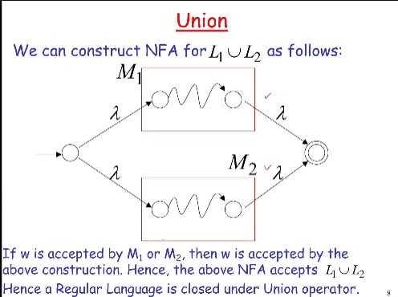
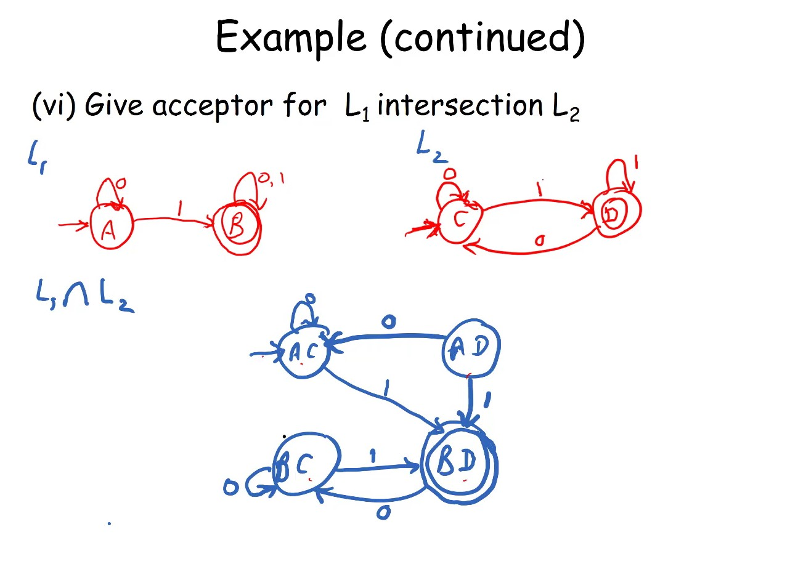

# **Automata Notes**


```Markdown
Format

### **Date**

##### **Time**

##### Note Subject
    * notes
        * more notes
            * even more notes
```

---

### **Date Month Year**

##### ***Time***

##### **Note Subject/Focus**
z
* notes
  * more notes
    * even more notes

---

### **13 August 2020**

##### ***1:27pm***

##### **Getting Ready for Fall2020**

* Professor : Raj Pammula
* [Syllabus] : https://calstatela.instructure.com/courses/52380/files/4198621?module_item_id=1919319
* Textbook : Peter Linz. Introduction to Formal Languages, and Automata, sixth edition.
Sudbury, Massachusetts: Jones & Bartlett, 2017. ISBN-13: 978-1-284077247

### **24 August 2020**

##### ***12:15pm***

##### **First Day of Fall 2020**

* asynchronus approach
* A typical weekly flow will be as follows:
* (i)A short virtual class (Monday 12.15PM for Section 1 and Tuesday (6PM for Section 2) to review the weekly activities. 
* (ii)Download PowerPoint file ahead to time.
* (iii)Watch the posted Video lectures. (The biggest facilitator in this format are the captioned videos generated over PowerPoint presentations that simulate classroom lectures. These videos can be replayed back many times to digest the concepts covered in the course.)
* (iv)Refer and read the Chapter/Section in the textbook.
* (v)Take any notes on the slides as you complete the above activities.
* (vi)Complete the Assignment on paper (as described).  (You will learn better when you process information, and that you process better when you write by hand.) Complete the assignment no later than Saturday midnight. The Assignmentwill be open throughout the week through Saturday.
* (vii)Complete the quiz in any 30 minute interval no later than Sunday night. The quiz is available on Friday/Saturday/Sunday.

---

### **27 August 2020**

##### ***1:35pm***

##### **Chapter 1 (Section 1.1) Sets** 
* a set is a collection of elements 
  *  A = {1,2,3}
  *  B = {train, bus, bicycle, airplane}
  *  C = {a, b, ... z} -> finite set
  *  S = {2, 4, 6...} -> infinite set
  *  S = {j | J > 0 , and j = 2, for some k > 0}
  *  | is such that
  *  S = {j | j is nonnegative and even}
* Set Cardinality
  * A = {2, 5, 7}
  * |A| = 3
  * just the set size
* Venn Diagram
  * as if often the case in mathematics, a picture helps clarify a concept. For sets, we use a tupl e of picture called a Venn Diagram. It represents sets as regions enclosed by circular lines
* Proof Techniques
  * proof by induction
  * proof by contradiction
  * proof by counter example
  * proof by construction

### **3 October 2020**

##### ***3:00pm***

##### **Chapter 2.1 Finite Automata**

##### Automata (Basic Classification)

 
 

##### Automata (Basic Classification)
* the power set of Q and is defines as the set of all subsets Q including the empty set and Q itself
* NFA permits several possible "next states" specified in one of the subsets of the power set
* an nfa rejects a string:
  * when there is no computation of the NFA that accepts the string: 
  * all the input is consumed and the automaton is in a non final state or 
  * the input cannot be consumed

##### The Key Differences between dfas and nfas are 
1. dfa: delta yields a single state
   nfa: delta yields a set of states
2. dfa: consumes input on each move
   nfa: can move without input (lambda)
3. dfa: moves for all inputs in all states
   nfa: some situations have no defined moves
* nfa's are interesting because we can express languages easier than dfa's

##### Equivalence of Machines


##### Reduction in Number of States of a DFA
* combining equivalent states
* partitioning technique


##### Regular Languages and Regular Grammars
* expand on the term regular
* regular languages
  * are accepted by dfas and nfas
  * but dfas and nfas are not concise descriptions
* thus we will examine regular expressions as a concise representation for regular languages
* + union
* . concatenation
* * star closure
##### Regular Expressions and Regular Languages
* there is an underlying nfa within a regular language
* an automaton that accepts the regular language

* regular expressions denote regular languages
* regular languages are represented by a regular expressions
* given an nfa we can construct a regular expression or a regular language


##### Regular Grammars
* Grammar G = (V,T,S,P)
  * V: set of variables
  * T: set of terminal symbols
  * S: start variable
  * P: set of production rules
* for regular grammars, there is a severe restriction on the production rules
  * x can only be one variable
  * y can only have at most one variable and more restriction on where the variable can occur
* regular grammars are further described by first defining a class of linear grammars
* a regular grammar is any right linear or left linear grammar (if a grammar mixes the concepts of right and left linearity, it is not a regular grammar)
* we seek to show the equivalence of language generated by right linear grammar and language accepted by nfa
* if w is in L(G), then there is a path in the NFA (by construction) from V0 to Vf
* if w is accepted by the NFA, then by construction we can produce a derivation sequence
##### Regular Grammars for Regular Languages


* summary
  * regular languages (expressed as regular expressions or accepted by NFA) and regular grammars are equivalent
  * NFA and DFA are equivalent
  * the construction algorithms in this chapter enable us to convert back and forth between the various representations of regular languages (regular expression, NFA or DFA, regular grammars)
* closure of regular languages under set operations
  * union
  * concatenation
  * star
  * reversal
  * complement
  * intersection

##### Properties of Regular Languages
* operations and closure
  * closure of a set with respect to an operator: an operation is performed on operands from a set and the output result also belongs to the same set
  * the set is then said to be closed under this operation ie. there is no new element that is added to the set because of this operation




* complement





##### Elementary Questions About Regular Languages


