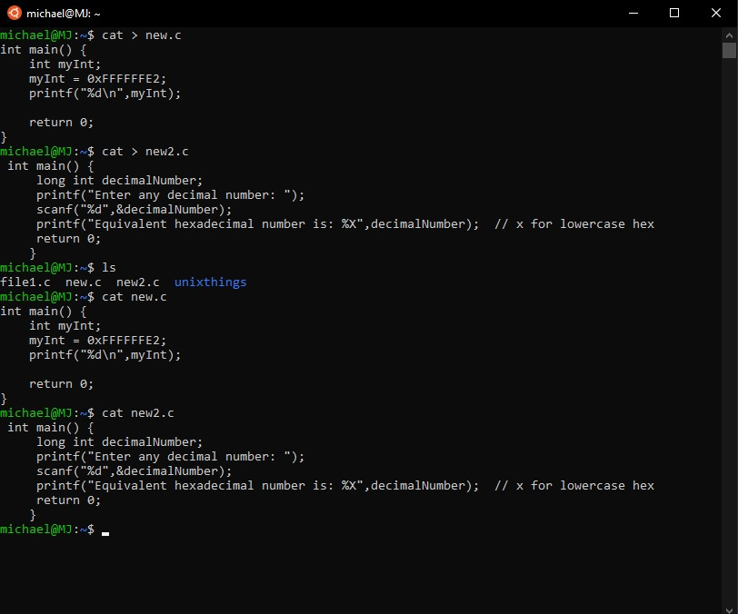
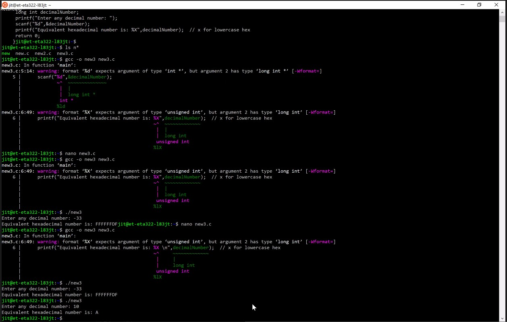

# **Operating Systems Notes**


```Markdown
Format

### **Date**

##### **Time**

##### Note Subject
    * notes
        * more notes
            * even more notes
```

---

### **Date Month Year**

##### ***Time***

##### **Note Subject/Focus**

* notes
  * more notes
    * even more notes

---

### **24 August 2020**

##### ***1:27pm***

##### **Getting Ready for Fall2020**

* Professor : Jithika Thomas
* [Syllabus] : https://calstatela.instructure.com/courses/54543/pages/course-syllabus
* Textbook : Operating SystemConcepts, 10th Edition Silberschatz, Galvin, and GagneJohn Wiley & Sons, Inc.ISBN-13: 978-1-119-45633-9
  

Agreement 1
I will only use my Cal State LA email address to correspond with the college and my instructor.  I will contact my instructor using the Canvas Inbox as the primary contact for this course.

Agreement 2
I understand that I need to include my FULL NAME and Course Number in the Subject of all emails of this course.

Agreement 3
I understand that I MUST participate in the first week of the course by completing the Student Learning Contract, introduction discussion, and other requirements set by my instructor.

Agreement 4
I understand that I must acquire my textbooks, software and all required materials, by the first week of the course.

Agreement 5
I will frequently visit the course to view announcements & Canvas Inbox, reference the Syllabus and review the grades section to understand the course requirements and expectations, including due dates.

Agreement 6
I understand that email submissions will not be accepted.

Agreement 7
I understand it is my responsibility to check due dates and adhere to all due dates. I understand that all assignments/quizzes must be submitted on time, before the submission closes, and no extension permitted.

Agreement 8
I understand that requests for retaking exams/quizzes to improve scores, from individual students are not permitted, since such requests warrant equal opportunities for the entire class.

Agreement 9
In the event that I fall behind in submitting course assignments or participating in activities and am unable to complete the coursework, I understand it is my responsibility to drop the course prior the final withdrawal date to avoid receiving a failing grade in the course.

Agreement 10
I understand some of my publicly displayed course postings or comments will be seen by other students. If I have any questions or need clarification of the assignments or course content, I will contact my instructor in a timely manner.

Agreement 11
I understand that I must submit my own work, not that of others, or templates from the Internet, books or articles, unless otherwise directed by the instructor. Files are checked for ownership, so if I share a computer with a classmate, I must notify the instructor immediately.

Agreement 12
I understand that I am  still responsible for announcements made on days that I am absent.

Agreement 13
I understand that I am responsible for reading, understanding and abiding by the Cal State LA policies.

Agreement 14
I understand that the student code of conduct prohibits various acts such as cheating, plagiarism, abusive language and other prohibited actions. Violations of this code may result in disciplinary action in regard to this course and college enrollment. I understand that I am responsible for reading, understanding, and abiding by the Cal State LA Academic Honesty Policy (Links to an external site.).

Agreement 15
I understand that if I have a verifiable disability, e.g. physical, communication, learning, acquired brain injury, psychological, or other disability and I am requesting an accommodation, it is my responsibility to make such a request.

---

* install linux
* operating system functions
* use any language
* all exams on canvas
* java is a compiled language, python is an interpreted language
* why do we  have an  operating system
* functionality and goal of the operating system

Chapter 1 : Introduction
* what operating systems do
* computer system organization
* coputer system architecture
* operating system structure
* operating  system operations
* pracess management
* memory management
* storage management

Four Components of a computer system
* computer hardware -> operating system -> system and application programs(compiler, assembler, text editor, database system) -> users

What is an operating system?
* a program that acts as an intermediary between a user of a computer and the computer hardware
* operating system goals:
  * execute user programs and make solving user problems easier
  * make the computer system more convenient to use
  * use the computer hardware in an efficient manner

What Operating Systems Do
* depends on the point of view
* users want convenience, ease of use and good performance
  * don't care about resource utilization

Operating System Definition
* OS is a resource allocator
  * manages 

Computer Startup
* bootstrap program is loaded at power up or reboot
  * typically stored in ROM or EPROM, generally known as firmware
  * initializes all aspects of system
  * loads operating system kernel and starts execution

### **9 September 2020**

##### ***1:50pm***

##### **Unix Tutorial**

##### The Kernel
* the kernel of unix is the hub of the operating system: it allocates time and memory to programs and handles the file store and communications in response to system calls

### **14 September 2020**

##### ***1:40pm***





