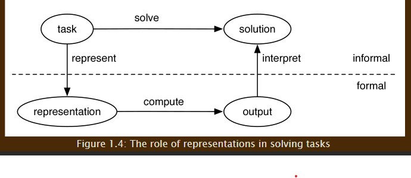

# **AI Notes**


```Markdown
Format

### **Date**

##### **Time**

##### Note Subject
    * notes
        * more notes
            * even more notes
```

---

### **Date Month Year**

##### ***Time***

##### **Note Subject/Focus**

* notes
  * more notes
    * even more notes

---

### **13 August 2020**

##### ***1:27pm***

##### **Getting Ready for Fall2020**

* Professor : Stephanie August
* [Syllabus] : https://calstatela.instructure.com/courses/52369/pages/complete-course-syllabus-8-slash-21-slash-2020?module_item_id=2272570
* Textbook : No required text

### **12 September 2020**

##### ***8:00pm***

##### **Being a Fucking Procrastinator about School atm**

* Chapters
  * Artificial Intelligence and Agents
  * Agent Architectures and Hierarchical Control
  * Searching For Solutions
  * Reasoning with Constraints
  * Propositions and Inference
  * Planning with Certainty
  * Supervised Machine Learning
  * Reasoning with Uncertainty
  * Planning with Uncertainty
  * Learning with Uncertainty
  * Multiagent Systems
  * Learning to Act
  * Individuals and Relations
  * Ontologies Planning, Learning, and Probabilistic Reasoning
  * Retrospect and Prospect

* Preface
  * AI is the study of the design of intelligent computational agents
  * ai has a coherent formal theory 
  * everything should be made as simple as possible but not simpler
  * probabilistic and logical reasoning are complementary


  * figure 1 shows the topics covered in the book. the solid lines depict prerequisites. Often the prerequisite structure does not include all sub topics.

##### Chapter 1: Artificial Intelligence and Agents
* What is Artificial Intelligence
  * artificial intelligence or ai is the field that studies the synthesis and analysis of computational agents that act intelligently
  * an agent is something that acts in an environment; it does something. Agents include worms, dogs, thermostats, airplanes, robots, humans, companies, and countries
  * we are interested in what an agent does; that is how it acts. We judge an agent by its actions
  * an agent acts intelligently when
    * what it does is appropriate for its circumstances and its goals, taking into account the short term and long term consequences of its actions
    * it is flexible to changing environments and changing goals
    * it learns from experience 
    * it makes appropriate choices given its perceprual and computational limitations
  * a computational agent is an agent whose decisions about its actions can be explained in terms of computation
  * it is an open question whether all intelligent agents are computational
  * all agents are limited
  * agents can only observe everything about the world in very specialized domains where "the world" is very constrained
  * agents have finite memory 
  * agents in the real world do not have unlimited time to act
  * central goal is to understand the principles that make intelligent behavior possible in natural or artificial systems. this is done by
    * the analysis of natural and artificial agents
    * formulating and testing hypotheses about what it takes to construct intelligent agents 
    * designing, building, and experimenting with computational systems that perform tasks commonly viewed as requiring intelligence
* Artificial and Natural Intelligence
  * turing test consists of an imitation game where an interrogator can ask a witness, via a text interface, any question. If the interrogator cannot distinguish the witness from the human, the witness must be intelligent.
  * winograd schemas have the property that (a) humans can easily disambiguate them and (b) there is no simple grammatical or statistical test that could disambiguate them
  * reacquire that ability to do commonsense reasoning
  * it is instructive to consider where human intelligence comes from
    * biology
      * humans have evolved into adaptable animals that can survive in various habitats
    * culture
      * culture provides not only language, but also useful tools, useful concepts, and the wisdom that is passed from parents and teachers to children
    * lifelong learning
      * humans learn throughout their life and accumulate knowledge and skills
  * most interesting and useful intelligent agents learn to improve their behavior
* A Brief History of Artificial Intelligence
  * symbolic reasoning evolution
  * any effectively computable function can be carried out on a turing machine (and so also in the lambda calculus or any of the other equivalent formalisms)
  * in addition to work on high level symbolic reasoning, there was also much work on low level learning inspired by how neurons work
* Relationship to Other Disciplines 
  * synthetic psychology, experimental philosophy, or computational epistemology.
  * ai can be seen as a way to study the nature of knowledge and intelligence but with a more powerful experimental tool than was previously available
  * modern computers provide a way to construct the models about which philosophers have only been able to theorize
  * ai researchers can experiment with these models as opposed to just discussing their abstract properties
  * ai researchers are interested in testing general hypotheses about the nature of intelligence by building machines that are intelligent and that do not necessarily mimic humans or organizations
* Agents Situated in Environments
  * a coupling of perception, reasoning, and acting comprises an agent
  * robot; physical setting
  * expert system
  * software agent; purely computational


  * agents in terms of its inputs and outputs
  * what an agent does depends on: 
    * prior knowledge about the agent and the environment
    * history of interaction with the environment, which is composed of 
      * stimuli received from the current environment, which can include observations about the environment, as well as actions that the environment imposes on the agent and 
      * past experiences of previous actions and stimuli, or other data, from which can learn
    * goals that it must try to achieve or preferences over states of the world
    * abilities, the primitive actions the agent is capable of carrying out
  * an agent has some internal belief state that can encode beliefs about its environment, what it has learned, what it is trying to do, and what it intends to do. an agent updates this internal state based on stimuli. it used the belief state and stimuli to decide on its actions. much of this book is about what is inside this black box
  * if an agent does not have preferences, by definition it does not care what world state it ends up in, and so it does not matter to it what it does.
  * the reason to design an agent is to instill preferences in it - to make it prefer some world states and try to achieve them
  * an agent does not have to know its preferences explicitly
  * the preferences of an agent are often the preferences of the designer of the agent, but sometimes an agent can  acquire goals and preferences at run time
* **Designing Agents**
  * artificial agents are designed for particular tasks. researchers have not yet got to the stage of designing an agent for the task of surviving and reproducing in a natural environment
  * ***Design Time, Offline and Online Computation***
    * three aspects of computation that must be distinguished
      * the computation that goes into the design of the agent
      * the computation that the agent can do before it observes the world and needs to act
      * the computation that is done by the agent as it is acting
    * design time computation
      * the computation that is carried out to design the agent. it is carried out by the designer of the agent, not the agent itself
    * offline computation
      * the computation done by the agent before it has to act. it can include compilation and learning. offline an agent can take background knowledge and data and compile them into a usable form called knowledge base. background knowledge can be given either at design time or offline
    * online computation
      * is the computation done by the agent between observing the environment and acting in the environment. a piece of information obtained online is called an observation. an agent typically must use its knowledge base, its beliefs and its observations to determine what to do next
    * designing an agent that can adapt to complex environments and changing goals is a major challenge
    * the advantage of building agents for complex environments is that these are the types of environments in which humans live and where we want our agents to be
  * ***Tasks***
    * ai representation typically specifies what needs to be computed, not how it is to be computed.
    * much of ai reasoning involves searching through the space of possibilities to determine how to complete a task

  

    * the general framework for solving tasks by a computer is given in figure 1.4. to solve a task, the designer of a system must:
      * determine what constitutes a solution
      * represent the task in a way a computer can reason about
      * use the computer to compute an output, which is answers presented to a user or actions to be carried out in the environment, and
      * interpret the output as a solution to the task
  * ***Defining a Solution***
    * much of ai is motivated by commonsense reasoning
    * we want the computer to be able to reach commonsense conclusions about the unstated assumptions
    * optimal solution
    * satisficing solution
    * approximately optimal solution
    * probable solution
  * ***Representations***
    * a physical symbol has the necessary and sufficient means for general intelligent action
    * an intelligent agent can be seen as manipulating symbols to produce action
    * it is often a good idea to model an environment at multiple levels of abstraction
    * knowledge level 
    * symbol level
* **Agent Design Space**
  * here we will describe ten dimensions of complexity in the design of intelligent agents
  * these dimensions define a design space for ai
  * these ten are not the only dimensions of complexity
  * ***Modularity***
    * modularity is the extent to which a system can be decomposed into interacting modules that can be understood separately
    * important for reducing complexity
    * typically expressed in terms of hierarchical decomposition
    * in the modularity dimensions, an agents structure is one of the following
      * flat
        * no organizational structure
      * modular
        * decomposed into interacting modules that can be understood on their own
      * hierarchical
        * the system is modular, and the modules themselves are decomposed into simpler modules, each of which are hierarchical systems or simple components
        * in a hierarchical structure the agent reasons at multiple levels of abstraction
        * large organizations have a hierarchical organization so that the top level decision makers are not overwhelmed by details and do not have to micromanage all activities
        * when tasks or systems become more complex, some hierarchical organization is required
  * ***Planning Horizon***
    * how far ahead in time the agent plans
    * ex. a dog does not act for goals arbitrarily far in the future, whereas people do
    * the time points considered by an agent when planning are called stages
    * non planning agent
      * time is not involved
    * finite horizon
      * fixed finite number of stages
      * greedy or myopic when only looks one step ahead
    * indefinite horizon
      * some finite number of steps but not predetermined
    * infinite horizon
      * plans on going on forever
      * often called a process
  * ***Representation***
    * how the world is described
    * different ways the world could be are called states
    * instead of enumerating states, it is often easier to reason in terms of features of the state or propositions that are true or false
    * a proposition is a boolean feature
    * in the representation dimension, the agent reasons in terms of 
      * states
      * features
      * individuals and relations(relational representations)
  * ***Computational Limits***
    * an agent must trade off how long it takes to get a solution with how good the solution is
    * it may be better to find a reasonable solution quickly than to find a better solution later because the world will have changed during the computation
    * computational limits dimension determines whether:
      * perfect rationality
        * where an agent reasons about the best action w/o taking into account its limited computational resources
      * bounded rationality
        * where an agent decides on the best action that it can find given it computational limitations


  * ***Learning***
    * an agent should use data from its past experiences and other sources to help it decide what to do
    * learning dimension determines whether
      * knowledge is given, or
      * knowledge is learned (from data or past experience)
    * learning is a huge field
    * there are many issues beyond fitting data, including how to incorporate background knowledge, what data to collect, how to represent the data and the resulting representations, what learning biases are appropriate, and how the learned knowledge can be used to affect how the agent acts
    * learning is considered in ch. 7, 10, 12, 15
  * ***Uncertainty***
    * sensing uncertainty dimension
      * concerns whether the agent can determine the state from the stimuli:
        * fully observable means the agent knows the state of the world from the stimuli
        * partially observable means the agent does not directly observe the state of the world, this occurs when many possible states can result in the same stimuli or when stimuli are misleading
        * assuming the world is fully observable is a common simplifying assumption to keep reasoning tractable
    * Effect Uncertainty
      * a model of dynamics of the world is a model of how the world changes as a result of actions, or how it changes even if there is no action.
      * the dynamics in the effect uncertainty dimension can be 
        * deterministic when the state resulting from an action is determined by an action and the prior state or
        * stochastic when there is only a probability distribution over the resulting states
    * this dimension only makes sense when the world is fully observable
    * if the world is partially observable, a stochastic system  can be modeled as a deterministic system where the effect of an action depends on some unobserved feature
  * ***Preference***
    * the only reason to choose one action over another is because the preferred action leads to more desirable outcomes
    * achievement goal is a proposition to be true in some final state
    * maintenance goal , a proposition that must be true in all visited states; ex. the goal for a robot may be to deliver coffee, and not to make a mess or hurt anyone
    * complex preferences involves trade offs among the desirability of various outcomes, perhaps at different times
    * ordinal preference
    * cardinal preference 
  * ***Number of Agents***
    * considers whether the agent explicitly considers other agents:
      * single agent
        * reasoning means the agent assumes that there are no other agents in the environment or that all other agents are part of nature, and so are non purposive. this is a reasonable assumption if there are no other agents or if the other agents are not going to change what they do based on the agent's action
      * multiple agent
        * reasoning means the agent takes the reasoning of other agents into account. goals and preferences depend, in part, on what the agent does or if the agent must communicate with other agents
  * ***Interaction***
    * interaction dimension considers whether the agent does
      * offline reasoning where the agent determines what ot do before interacting with the environment or
      * online reasoning where the agent must determine what action to do while interacting in the environment, and needs to make timely decisions
  * ***Interaction of the Dimensions***


* Prototypical Applications

##### Chapter 2: Agent Architecture and Hierarchical Control
* on theoretical grounds we would expect complex systems to be hierarchies in a world in which complexity had to evolve from simplicity
* this chapter shows how an intelligent agent can perceive, reason, and act over time in an environment.

* **Agents**
  * agents act in the world through their actuators
  * agents often carry out actions to find more information about the world

* **Agent Systems**

  * together the system consisting of the agent and the environment is known as an agent system
  * agent receives stimuli from the environment and carries out actions in the environment
  * agent is made up of a body and a controller
    * controller receives percepts from the body and sends commands to the body
    * body includes sensors that convert stimuli into percepts and actuators that convert commands into actions
  * the controller is the brain of the agent. the rest of this chapter is about how to build controllers

* **The Agent Function**
  * agents are situated in time; they receive sensory data in time and do action in time. the action that an agent does at a particular time is a function of its inputs. we first consider the notion of time
  * time aussume that T is totally ordered and has some metric that can be used to measure the temporal distance between any two time points
  * T is discrete
  * T is dense if there is always another time point between any two time points
  * P is the set of all possible percepts
  * percept trace is a function from T into P. specifies what is observed at each time
  * C is the set of all commands
  * command trace is a function from T into C. it specifies the command for each time point

  * percept trace is the sequence of all past, and future percepts received by the controller
  * transduction, a function from percept traces into command traces
  * a transduction is causal if, for all time t, the command at time t depends only on percepts up tp and inculding time t. The causality restriction is needed because agents are situated in time
  * a controller is an implementation of a causal transduction
  * causal transduction maps the agent's history at time t into the command at time t. it can be seen as the most general specification of a controller
  * the belief state of an agent at time t is all the information the agent has remembered from the previous times
    * encapulates all of the information about its history that the agent can use for current and future commands. at any time, an agent has access to its belief state and its current percepts
  * belief state transition function for discrete time
    * remember: S X P -> S
  * command function
    * command: S X P -> C
  * the belief state transition function and the command function together specify a causal transduction for the agent
  * a causal transduction is a function of the agent's history, which the agent does not necessarily have access to, but a command function is a function of the agent's belief state and percepts, which it does have access to


* **Hierarchical Control**

### **19 September 2020**

##### ***10:00pm***

##### **Search**
* Basic Search Terms
  * expand: determine children
  * open node: unexpanded node
  * closed node: expanded node
  * branching factor: number of children each internal node has
    * min number of children is 0 (leaf node)
    * average number of children
    * max number of children (worst case)
  * Note: search procedures start with no knowledge of the ultimate size or shape of the complete search tree 

  * A Search Tree is a representation
  * that is a semantic tree
  * in which 
  * nodes denote paths
  * branches connect paths to one step path extension
  * with writers that 
    * connect a path to a path description
  * with reader that 
    * produce a path's description 
* Depth First Search


*Breadth First Search


* DFS vs BFS
  * depth first search
    * requires less memory
    * might find a solution without examining much of the search space
    * can follow a single, unfruitful path for a long time
    * might find the long path to a solution
    * use when:
      * all partial paths either
        * reach dead ends
        * become complete paths after a "reasonable" number of steps
    * branching factor is too great to handle
    * all paths lead to goal nodes at the same depth
  * breadth first search
    * requires more memory
    * all nodes at level n must be examined before any nodes at level n + 1 are examined
    * will not get trapped in a "blind alley"
    * if solution exists, bfs is guaranteed to find it
    * use when:
      * tree is infinitely/ineffectively deep
    * the depth of the search tree is known to be infinite

### **30 September 2020**

##### ***3:00pm***

##### **Librarian Day**
* scholarly and popular sources
  * scholarly
    * peer reviewed
    * original research
    * written by professors, researcher or professionals
    * evaluated by experts
  * popular
    * sensational

https://vimeo.com/175421451

https://www.library.unlv.edu/sites/default/files/2020-01/information_lifecycle_tutorial_script.pdf

https://www.library.unlv.edu/tutorial-videos

* popular, scholarly, primary, secondary, tertiary
* news
* magazines
* journal articles
* books
* government publications
* encyclopedias
* bibliographies
* audience 
* content


