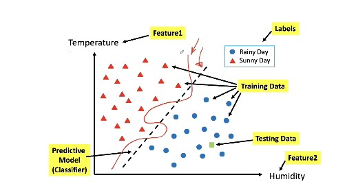

# **Data Sciece Notes**


```Markdown
Format

### **Date**

##### **Time**

##### Note Subject
    * notes
        * more notes
            * even more notes
```

---

### **Date Month Year**

##### ***Time***

##### **Note Subject/Focus**

* notes
  * more notes
    * even more notes

---

### **13 August 2020**

##### ***1:27pm***

##### **Getting Ready for Fall2020**

* Professor :  Dr. Mohammad Pourhomayoun
* [Syllabus] : https://calstatela.instructure.com/courses/52390/files/4185339?module_item_id=2252444
* Textbook : No required text

### **31 August 2020**

##### ***1:00pm***

##### **Introduction (Video 1)**

##### What is Data Science? 
* data science is an inter disciplinarry field of research that aims to design and develop automated or semi automated techniques to extract knowledge (information) from large scale data and use it for futrue purposes such as prediction, decision making, or recommendation
* it can be an integration of machine learning, statistics, big data processing, predictive analytics, and computing

##### Why is Data Science So Important Now?
* why was no one talking about it 10 years ago?
* bc now we have
  * new sources of data that did not exist before
  * new capabilities to acquire, store, and process data
  * new algorithms and methods to analyze data

##### New Sources of Data
* social networks
* world wide web
* online acitivites 
* electrical health records
* body and wearable sensors
* "There was 5 exabytes of inforamtion (5x10^18 bytes)"created between the dawn of civilization through 2003, but that much information is now created every two days".  - Eric Schidt, Google, Alphabet

##### New Capabilites to Acquire, Prcess and Store Data
* the cost of data acquisition, processing, and storing data has dropped incredibly fast thanks to advances in electronics and other technologies

##### Why Python?
* python is very powerful and highly popular for datascience purposes
* python is an eaty to learn, widely used, and general purpose programming language
* python inclused unique powerful libraries designed for data science 
* python supoorts both object oriented and procedural programming styles

##### Applications of Data Science
* consumer recommender system
* speech recognition
* stock market prediction
* real estate prediction
* robotics
* spam detection
* social media / ads
* object / facial recognition
* self driving cars
* health care

##### Ingredients of Data Science
* Data : Tapid growth of massive datasets
  * ex. wwww, social networks, online activites, smart phone, wearables, sensor networks
* Machine Learning : It is applied everywhere
  * ex. reccomendation system , market prediction, speech recognition, face detection, fraud detection, spam filtering, vehicle control, medical diagnosis
* Big Data Manipulation and Processing:
  * large scale data processing, distributed computing, cloud computing

### **7 September 2020**

##### ***9:25pm***

##### **Data Analytics and Machine Learning (Video 3)**

##### What is Machine Learning?
* a definition: designing and constructing algorithms or methods that give computers the ability to learn from past data, without being explicity programmed, and then make predictions on future data
* another definition: as set of algorithms that can automatically detect and extract patterns in past data, and then use the extracted patterns to predict on future data, or to perform other kinds of decision making
* code is not explicitly programmed to generate the rules instead you provide data to the machine learning algorithm and the machine learning algorithms will discover the rules from the data
* process of learning is training
* after training we will have a trained machine learning algorithm 
* and in the future it will be able to make predictions with the trained algorithm

##### Example: Weather Forecasting
* suppose that we have the temperature and humidity of the past 30 days
* we also know whether those days were sunny or rainy
* questions: now, if we know the temperature and humidity of tomorrow, can we predict tomorrow outlook (predict whether tomorrow is rainy or sunny)?
* two data elements (features)
* temperature(x) and humidity(y)
* on an axis there are data points (days) representing whether it was rainy or sunny on that data point/day 
* from what happened in the past we can predict what will happen in the future
* the separation between the rainy and sunny data points is called a classifier
* the classifier can be used for prediction
* if a data point lies on the right hand side of the classifier we know that there is a likely chance that it will be rainy and vice versa for sunny
* emphasizes that this is a simple example and that real data sets will not be as simple
* in more realistic data sets the points will be more mixed and will be more difficult to pin point the classifier

##### Terminology
* Observations: Data Samples (Data Examples)
* Features (inputs): attributes that represent an observation e.g. temperature, humidity
* Labels (outputs): values assigned to observations(also called class or target) e.g. rainy/sunny
* Training Data: past observations given to the machine learning algorithm to learn from (training) e.g. temperature and humidity of the past 30 days, along with the label for those days
* Testing or Prediction Data: observations given to a "predictive model" for prediction 



* realistically is tyrying to find the classifier in a 100 dimensional space with mixed labels

##### Another Example: Predicting/Diagnosing Cancer
* Data: Suppose that we have the size and density of 100 tumors observed in 100 patients in the past
* we also know whether the tumors were malignant of benign
* Questions: Now, if we know the size nad softness of a tumor in a new patient, can we predict if the tumor is malignant or benign
* Suppose that we have medical data of 100 patients diagnosed with a tumor in their body. We know the age and gender of patients. For each patient, we also know the size and density of tumors, After Biopsy examination, we know which one of these patients has malignant tumor and which one has benign tumors
* Now, for 5 new patients, with tumors, having the size and density of tumors, and age and gender of patients, we would like to predict the type of tumor without biopsy procedure
* can you define training data, testing data, features, and labels for this problem?

##### More Terminology
* Training Stage (Modeling): building a predictive model based on the training dataset (past data)
  * the model does not have to be perfect, as long as it is close, it is useful
  * we should tolerate randomness and mistakes
* Testing Stage (Prediciton): applying the trained model to forecast what is going to happen in the future (on future testing data)

##### **Machine Learning Settings (Video 4)**

##### Common Learning Settings
* supervised learning
* unsupervised learning
* semi supervised learning
* reinforcement learning
* transfer learning
* active learning


