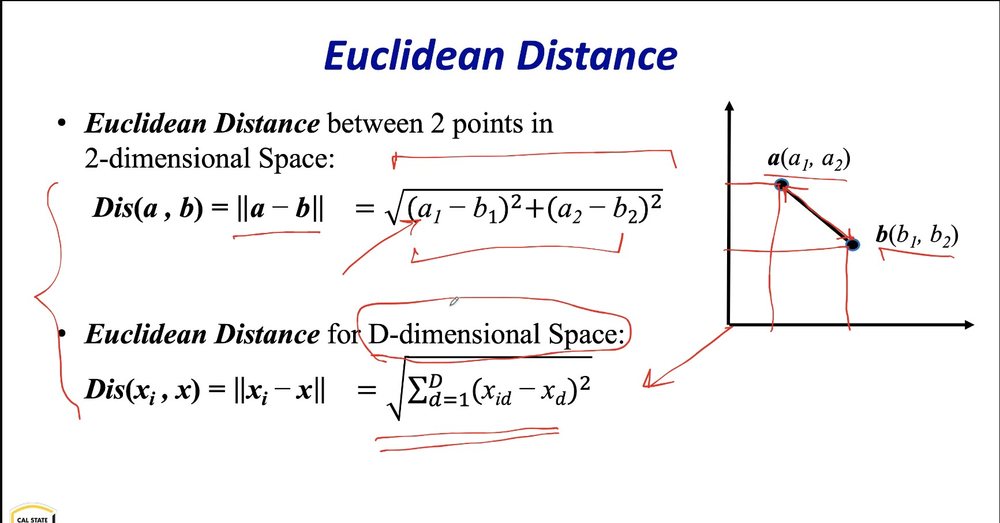
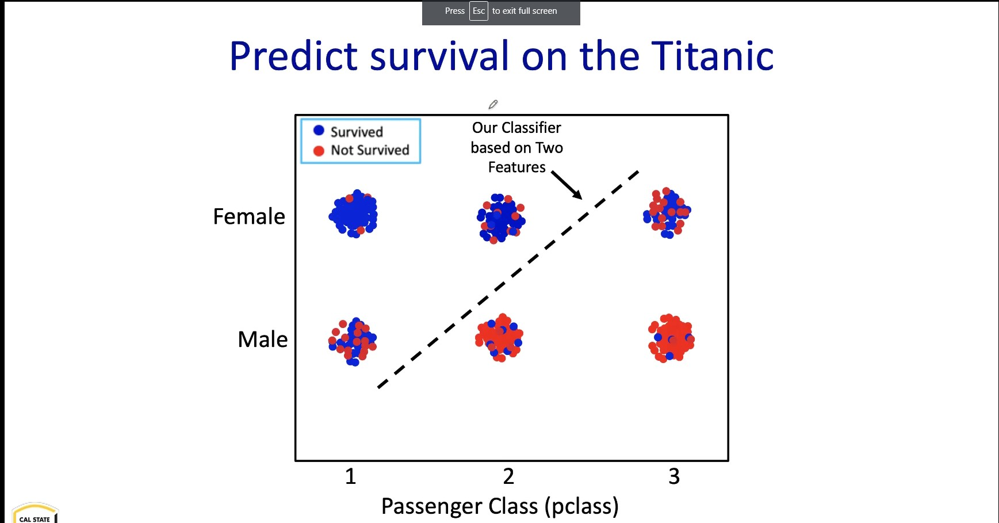

# **Data Science Notes**


```Markdown
Format

### **Date**

##### **Time**

##### Note Subject
    * notes
        * more notes
            * even more notes
```

---

### **Date Month Year**

##### ***Time***

##### **Note Subject/Focus**

* notes
  * more notes
    * even more notes

---

### **13 August 2020**

##### ***1:27pm***

##### **Getting Ready for Fall2020**

* Professor :  Dr. Mohammad  Pourhomayoun
* [Syllabus] : https://calstatela.instructure.com/courses/52390/files/4185339?module_item_id=2252444
* Textbook : No required text

### **31 August 2020**

##### ***1:00pm***

##### **Introduction (Video 1)**

##### What is Data Science? 
* data science is an inter disciplinarry field of research that aims to design and develop automated or semi automated techniques to extract knowledge (information) from large scale data and use it for futrue purposes such as prediction, decision making, or recommendation
* it can be an integration of machine learning, statistics, big data processing, predictive analytics, and computing

##### Why is Data Science So Important Now?
* why was no one talking about it 10 years ago?
* bc now we have
  * new sources of data that did not exist before
  * new capabilities to acquire, store, and process data
  * new algorithms and methods to analyze data

##### New Sources of Data
* social networks
* world wide web
* online acitivites 
* electrical health records
* body and wearable sensors
* "There was 5 exabytes of inforamtion (5x10^18 bytes)"created between the dawn of civilization through 2003, but that much information is now created every two days".  - Eric Schidt, Google, Alphabet

##### New Capabilites to Acquire, Prcess and Store Data
* the cost of data acquisition, processing, and storing data has dropped incredibly fast thanks to advances in electronics and other technologies

##### Why Python?
* python is very powerful and highly popular for datascience purposes
* python is an eaty to learn, widely used, and general purpose programming language
* python inclused unique powerful libraries designed for data science 
* python supoorts both object oriented and procedural programming styles

##### Applications of Data Science
* consumer recommender system
* speech recognition
* stock market prediction
* real estate prediction
* robotics
* spam detection
* social media / ads
* object / facial recognition
* self driving cars
* health care

##### Ingredients of Data Science
* Data : Tapid growth of massive datasets
  * ex. wwww, social networks, online activites, smart phone, wearables, sensor networks
* Machine Learning : It is applied everywhere
  * ex. reccomendation system , market prediction, speech recognition, face detection, fraud detection, spam filtering, vehicle control, medical diagnosis
* Big Data Manipulation and Processing:
  * large scale data processing, distributed computing, cloud computing

### **7 September 2020**

##### ***9:25pm***

##### **Data Analytics and Machine Learning (Video 3)**

##### What is Machine Learning?
* a definition: designing and constructing algorithms or methods that give computers the ability to learn from past data, without being explicity programmed, and then make predictions on future data
* another definition: as set of algorithms that can automatically detect and extract patterns in past data, and then use the extracted patterns to predict on future data, or to perform other kinds of decision making
* code is not explicitly programmed to generate the rules instead you provide data to the machine learning algorithm and the machine learning algorithms will discover the rules from the data
* process of learning is training
* after training we will have a trained machine learning algorithm 
* and in the future it will be able to make predictions with the trained algorithm

##### Example: Weather Forecasting
* suppose that we have the temperature and humidity of the past 30 days
* we also know whether those days were sunny or rainy
* questions: now, if we know the temperature and humidity of tomorrow, can we predict tomorrow outlook (predict whether tomorrow is rainy or sunny)?
* two data elements (features)
* temperature(x) and humidity(y)
* on an axis there are data points (days) representing whether it was rainy or sunny on that data point/day 
* from what happened in the past we can predict what will happen in the future
* the separation between the rainy and sunny data points is called a classifier
* the classifier can be used for prediction
* if a data point lies on the right hand side of the classifier we know that there is a likely chance that it will be rainy and vice versa for sunny
* emphasizes that this is a simple example and that real data sets will not be as simple
* in more realistic data sets the points will be more mixed and will be more difficult to pin point the classifier

##### Terminology
* Observations: Data Samples (Data Examples)
* Features (inputs): attributes that represent an observation e.g. temperature, humidity
* Labels (outputs): values assigned to observations(also called class or target) e.g. rainy/sunny
* Training Data: past observations given to the machine learning algorithm to learn from (training) e.g. temperature and humidity of the past 30 days, along with the label for those days
* Testing or Prediction Data: observations given to a "predictive model" for prediction 


* realistically is tyrying to find the classifier in a 100 dimensional space with mixed labels

##### Another Example: Predicting/Diagnosing Cancer
* Data: Suppose that we have the size and density of 100 tumors observed in 100 patients in the past
* we also know whether the tumors were malignant of benign
* Questions: Now, if we know the size nad softness of a tumor in a new patient, can we predict if the tumor is malignant or benign
* Suppose that we have medical data of 100 patients diagnosed with a tumor in their body. We know the age and gender of patients. For each patient, we also know the size and density of tumors, After Biopsy examination, we know which one of these patients has malignant tumor and which one has benign tumors
* Now, for 5 new patients, with tumors, having the size and density of tumors, and age and gender of patients, we would like to predict the type of tumor without biopsy procedure
* can you define training data, testing data, features, and labels for this problem?

##### More Terminology
* Training Stage (Modeling): building a predictive model based on the training dataset (past data)
  * the model does not have to be perfect, as long as it is close, it is useful
  * we should tolerate randomness and mistakes
* Testing Stage (Prediction): applying the trained model to forecast what is going to happen in the future (on future testing data)

##### **Machine Learning Settings (Video 4)**

##### Common Learning Settings
* supervised learning: learning from labeled observations
  * in training stage, the algorithm is presented with features and their known labels, and the goal is to train a model that maps future inputs to new labels
  * neural networks (ANN), k-nearest neighbors classifier (KNN), decision tree classifier, linear regression, logistic regression, polynomial regression, random forest,...
* unsupervised learning: learning from unlabeled observations
  * the algorithm is presented only with features. the goal is to discover hidden patterns and structure from features alone. it is like a data exploration to find hidden patterns
* semi supervised learning
  * labels are provided only for a part of the training data, the reamaing data is unlabeled
* reinforcement learning
  * learning from an agent taking actions in an environment so as to maximize a long term reward eg. game theory, control theory
* transfer learning
  * learning from a dataset while solving a problem, and then applying the extracted knowledge to a different but related dataset/problem
* active learning
  * similar to semi supervised learning, but the algorithm is able to interactively query the user or some other information source to obrain the labels as needed
* in terms of commercial success: supervised -> transfer -> unsupervised -> reinforcement
* supervised learning: learning from labeled data

* training stage
  * provide algorithm features and labels of the training data
  * machine algorithm will learn from historical data
* we then have a predictive model
* in testing stage
  * provide features, with unknown labels
  * then we will get predicted labels
* the algorithm will learn from previous data (previous emails) that what combination of words indicate suspicious emails

* not necessarily the future more of a detection
* two important approaches to supervised learning
  * classification: predict a discrete valued output for each observation
    * labels are discrete (categorical)
    * labels can be binary (rainy/sunny, spam/not-spam) or non-binary (eg rainy/sunny/cloudy , object recognition (100 classes))
  * regression: predict a continuous valued output for each observation
    * labels are continuous (numeric), eg stock price, housing price
    * can define 'closeness' when comparing prediction with true values


* classification example: multi label
  * recognizing flowers
    * types of iris (labels): setosa, versicolor, virginica
    * features: sepal length, sepal width, petal length, petal width
* regression
  * housing price
    * target, predict the price
    * multiple features (eg sqaure footage, number of rooms, modern or not modern)
    * predictive linear regression model
    * predictive quadratic regression model
      * a little more accurate


### **14 September 2020**

##### ***11:00am***

##### **Week 3 (Video 1)**

##### K-Nearest Neighbor Classifier (KNN Classifier)
* classifies objects based on the closest training samples in the feature space
* find the closest sample nearest to the new data point based on where the classifier is, we can predict the label
* making a decision only based on one sample is risky, because it is not reliable and it is very vulnerable to noise or mistakes in training set 
* knn classifier classifies objects based on majority of K closest training samples in the feature space eg k = 5

* since there are more blues data near the selected point we predict that the new data is blue
* training feature table
  * in this example we have 6 training data samples (6 different flowers), 4 features and label has 3 classes (3 different types of iris)


* some theory behind the algorithms
* we will use advanced libraries so calculations are easy


##### **Week 3 (Video 2)**

##### How to Select K?
* what are the advantages of a small or large k
* it depends on the data and the application
* benefits of large k 
  * ignores the effect of outliers
  * better decision making
* benefits of a small k
  * simple model
  * low computational complexity
  * no bias towards popular labels
    * data in reality is not perfectly balanced
    * if there is a smaller k
    * overfeeding: when a model trains too much and it learns patterns from the noise
##### Decision Boundary
* for every possible point in the space, we can determine it label using the KNN rule. this gives a decision boundary that partitions the space into different regions
##### Advantages and Disadvantages
* advantages of using KNN classifier
  * easy and simple to implement
  * low computational complexity 
* disadvantages
  * computationally intensive for large scale problems: inefficient for Big Data (because we need to find millions of distances, and then find the shortest one each time)
  * choosing the best k is challenging, using brute force is generally the best method
##### A Practical Hint about KNN
* beginner mistake that is commonly made
* if features are almost in the same range, there is generally no problem
* distances depend on the unit of the feature
* ex. predict if a house will be sold within 30 days or not based on size of the house and number of bedrooms
* f1 = size (0-4000sqrft)
* f2 = numberOfBedrooms (1-5)
* the mla ignores the effect of numberOfBedrooms bc it is negligible
* when a knn model is made, predictions are not accurate bc data is not normalized
* we need to scale (normalize) the features before training/testing


* divide by the maximum value in order to normalize the values
* after scaling or normalizing the graph will be in the scale of 0 to 1
* so the number of bedrooms can have the same importance as the sqr footage
##### A more advanced technique for normalization
* wwe can alo normalize data samples to have zero mean and unit standard deviation in each dimension (ie for each feature). in other words, we should normalize each column of the feature table individually

##### Jupyter Notebook
* in this course, we work with python and its libraries
* web based interactive development environment, in which you can combine code execution, text and notations (markdown), in mathematics, and plots

### **20 September 2020**

##### ***11:00am***

##### **Week 4 (Video 1)**

##### Decision Tree Classifier

* Titanic Disaster 
  * Let's start this topic with a famous problem/competition from kaggle website: predicting survival on the titanic
  * not enough life boats
  * not expected
  * some people were more likely to survive than others
  * based on features such as gender, age, status
  * we can predict who survived and who did not


  * six features
  * one label
  * there are patterns 
* A Naive Classifier for the Titanic
  * making decisions based on only one feature
    * example: based on gender: if most females survived, then let's assume every female survives
    * so our naive classification rule will be:
```
if (sex='female') then survive <- yes
else if (sex='male') then survive <- no
```
  * based on "pclass"
```
if (pclass='1') then survive <- yes
if (pclass='2') then survive <- yes
if (pclass='3') then survive <- no
```


  * making a dexision based on two features
    * exmaple based on "gender" and "pclass"
  * so our classification rule will be:
```
if(sex='female'): 
  if (pclass=1) or (pclass=2) then: survive <- yes
  else if (pclass=3) then survive <- no
if(sex='male'): 
  if (pclass=2) or (pclass=3) then: survive <- no
  else if (pclass=1) then survive <- yes
```


* an improvement on the classifier
  * making decision based on three features
    * example: based on "gender", "pclass", "age"

```
if(sex='female'):
  if(pclass=1) or (pclass=2) then survive <- yes
  else if(pclass='3'):
    if {age < 4} then: survive <- yes
    else if{age >4} then: survive <- yes
if(sex='male'):
  if(pclass=2) or (pclass=3) then survive <- no  else if(pclass='1'):
    if {age < 4} then: survive <- yes
    else if{age >4} then: survive <- no
```
  * another layer on classification

* it is in the form of a tree
* machine learning model should handle hidden or missing features
##### Important Note
* every prediction model has some levels of error
* it is rare to have a predictor with 100% accuracy
* prediction model should automatically build a tree based on historical data
##### Training a Decision Tree Model
* three things to learn in training stage: 
  * the structure of the tree: the priority of features (hierarchy of features)
  * the threshold values
  * the values for the leaves
* question: how to select the first feature at the top of the tree: the best feature that can split(classify) the data samples
* Idea: the best feature is the one that provides the most amount of information about the label
* so, we need a metric to measure information

### **23 September 2020**

##### ***3:00pm***

##### **Week 4 (Video 2)**

##### Claude E. Shannon (1916-2001) The Father of Information Theory
* founded information theory "A Mathematical Theory of Communication"
* he is, perhaps, equally well known for founding digital circuit design theory
##### Two Important Concepts about Measuring the Information
* 1. The amount of information about an event x has inverse relationship to the probability of that event
  * example: 
    * "The sun will rise tomorrow morning"
    * "An eclipse occurs tomorrow"
    * which one provides the most information
  * I(X)~1/p(x)
* 2. When two independent events happens, the joint probability of them is the multiplication of the two probabilities . However, the total information about two independent events should be the summation of the two pieces of information.
  * example: flipping a coin twice: h,t
    * prob(two independent events) = prob(event) * prob(event2)
    * info(two independent events) = info(event1) + info(event2)


* so the "information function" should have this property:
```
Information(p1,p2) = information(p1) + information(p2)
```
 
 

* note: it is common to use log based 2 and then the unit of information is in bit

##### Entropy
* entropy measures the amount of "uncertainty" or "unpredictability".
* in other words, entropy is the "expected information" information we don't have but we expect
 
##### Example: Flipping a Coin
* Question: We have a Fair Coin and and Unfair Coin. If we flip both coins, which one is more predictable (H,T)
 
 

##### Information Gain
* reminder: entropy measures the uncertainty
* idea: gaining information reduces uncertainty
* in case of decision tree, we define Information Gain as the reduction in the Entropy from before to after the dataset is split on a feature
 

##### Splitting in Decision Trees
* Question: which feature do we choose at each level of the tree to split data samples?
* answer: the one with the largest information gain
  * the one that reduces entropy the most

##### **Week 4 (Video 3)**
##### Training a Decision Tree Classifier
 
* which feature gives you the lowest drop in entropy and the feature that gives you the most information gain
 
 
* .98bit -> .85bit windy entropy reduction

* .98bit -> .28 humidity entropy reduction 
* 
* .98bit -> .67 temperature entropy reduction

##### The Best Feature
* in this example, splitting the data samples based on humidity will minimize the entropy(unpredictability) compared to other features
* in other words, splitting based on humidity provides the maximum amount of information gain at this level
* so, the best feature to split the data samples at the top of the decision tree is humidity
##### Building a Decision Tree (ID3 Algorithm)
1. calculate the entropy after splitting the dataset based on every feature
2. select the feature for which the entropy is minimum (information gain is maximum) 
3. split the dataset into subsets using that feature, and make a decision tree node for that
4. Repeat with remaining features
5. Stop splitting a branch if:
    - no features left, or
    - all samples assigned the same label

Note: In ID3, we assume that features are discrete. Thus, we need to Discretize continuous attributes
##### Discretizing Continuous Attributes
* we need to define intervals/thresholds to discretize continuous features
* general approach (brute force): we have to try every possible split to see which one minimizes the entropy
* Any smarter way to do it?


* there are powerful libraries that do these calculations 
* the most important is to understand how everything works
##### Advantages and Disadvantages
* advantages of using decision tree classifier:
  * easily interpretable by human
  * handles both numerical and categorical data
  * it is a parametric algorithm: unlike KNN, we do not need to carry our training dataset around
* Disadvantages
  * very prone to overfitting (more on this later)
  * heuristic training techniques (brute force, trial and error)
* later on random forest that is based on decision tree

##### **Week 5 (Video 1)**
##### Numpy
* provides a lot of powerful functions for advanced mathematical operation. it provides objects and data structures to process large, multi-dimensional arrays and matrices in very short time
* you will learn some capabilities of numpy in future tutorials
##### Pandas
* pandas is a powerful package to read, manipulate, and process large scale data
* pandas introduces two new data structures to python, series, and dataframe, both of which are built on top of numpy n-dimensional array 
* a series is a one dimensional vector similar to an array, list, or column, in a table. it will assign an index to each item in the series (starting from 0)
* a dataframe is a structured data table (or Matrix) comprised of rows and columns
* each column of a dataframe can be considered as a series
* you will learn the properties and capabilities of pandas in next tutorials
* did the pandas and numpy tutorial on jupyter

##### **Week 5 (Video 2)**
##### Evaluating The Accuracy Of Our Predictive Model
* here is a simple way to evaluate the accuracy of out predictive model
  * 1. lets split the dataset randomly into two new datasets: training set (eg 70percent of the data samples) and Testing Set (30percent of the data)
  * 2. lets pretend that we do NOT know the label of the testing set
  * 3. lets train the model only on the training set, and then predict on the testing set
  * 4. after prediction, we can compare the predicted labels for the testing set with the actual labels of it to evaluate the accuracy of out prediction
  * we will learn more techniques for model evaluation (cross validation method)


* very important: there must be no overlap between training set and testing set
* Note 1: later, we will see that we can split the original dataset into 3 sets: training set, validation set, and testing set. in this case, we can use validation set for adjusting the classifier parameters, and then use testing set for final evaluation
* Note 2: later, we will also talk about cross validation approach. in cross validation, several rounds of partitioning will be applied to assure that all data samples are used both in training set and testing set but not simultaneously (NO OVERLAP!)

##### Scikit-Learn: A library for data science and machine learning
* sklearn is the python machine learning library
* it includes optimal implementation of various classification, regression and clustering algorithms
* it also includes hundreds of commands and functions for data preprocessing and processing with a number of default datasets to work with
* It is designed to interoperate with Python and scientific libraries numpy and scipy
* scikit learn has an exceptional documentation
##### Important Hint about sklearn
* sklearn only accept numerical features. thus, we have to convert no-numerical(categorical) features into numerical values
* note: in converting features(and sometimes labels), we have to be cautious to avoid defining a confusing "ordering" between categorical values (we will talk about it later in this course)
* depending on the classification algorithm, we usually use LabelEncoding to convert labels, and/or onehotencoding to convert features
##### 5 Steps to make Prediction in sklearn
* step1: importing the sklearn class (the machine learning algorithm) that you would like to use for prediction FROM sklearn library
* step2: set up the feature matrix and label vector
* step3: defining (instantiating) and "object" (instance) of the sklearn class as an initial predictive object
* step4: training stage: train the above predictive model using the training dataset
* step5: testing(prediction) stage: evaluating the machine learning model and results and eventually, making prediction on new observations using the trained model

##### **Week 5 (Video 3)**
* tutorial on scikit learn
* we will train our first machine learning model


### **28 September 2020**

##### ***4:30pm***

##### **Week 6 (Video 1)**

##### Linear Regression
* regression: predicts continuous valued output
  * labels are continuous, eg, stock price, housing price
  * can define 'closeness' when comparing prediction with true values
  * 
##### Linear Regression Examples
* predicting a company's future stock price using it profit and other financial information
* predicting housing price based on the property information (size, # rooms,... )
* predicting annual rainfall based on the weather information
* predicting a risk of granting a credit card based on financial and personal information
##### Special Case
* Let's start with a simple, special case: linear regression with single input variable (on feature). It is also called "Univariate Linear Regression"
* this example only looks at one feature


* the model can be multi dimensional and non linear
* goal is to find the line


* memorize the regression model 
* how to find the line of best fit
##### How to find the Regression Model?
* Question: How fo find the best fit line? In other words, How to find the Parameters of theta0 and theta1 that correspond to the best line?


* what is the best theta i

##### How to Select the Parameters
* How to find the bes Parameters theta i's

* we want to make the regression line as close to all point in order to minimize error
* Question: which distance should be minimum to find the best fit line? the distance to the line or the vertical distance


### **28 September 2020**

##### ***6:40pm***

##### **Week 7 (Video 1)**

##### Linear Regression (cont.)
* contour: the projection of the J surface on the "floor plane"
* how to minimize the cost function?
  * we can use "gradient descent" algorithm to minimize the const function and find the parameters (a generalization of the usual concept of derivative for functions of several variables)

##### Gradient Descent Algorithm
* gradient descent is an iterative optimization approach that tries to minimize a function
* the gradient is a generalization of the usual concept of derivative for functions of several variables
* the gradient represents the slope of the tangent of the graph of the function
* the negative gradient points in the direction of the greatest rate of reduction of the function, and its magnitude is the slope of it that direction

* the negative direction of the gradient at the current point is the steepest direction at the moment
* in other words, a differentiable function F decreases fastest if one moves in the direction of the negative gradient of function F at point x
* coming down the mountain on the most efficient and fastest path
* gradient descent iteratively takes steps with a predefined rate in the negative direction of the function gradient at the current point (the steepest direction)


* Note1: at this point, the convergence achieved (the minimum found): the slope of a horizontal line is zero, so no more move!
* Note2: as we move toward a local minimum, the gradient descent automatically takes smaller steps in each iteration (because the slope gets smaller)
* a alpha is learning rate that controls the step size toward the steepest direction
* too small alpha: convergence will be too slow
* too large alpha: the algorithm may overshoot the minimum. it may fail to converge

* need not memorize equations but understand how they work


##### Linear Regression with Multiple Features


##### Important Tip: Implementing Gradient Descent in Practice
* make sure to normalize data samples to have all features on a similar scale
* divide each feature by the maximum of that specified feature
* make it in the range of 0 to 1


